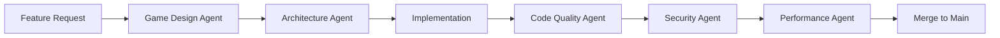

# AI Agent Development Framework

## 🤖 Specialized Agents for Game Development

### 1. **Architecture Agent** (`architecture-agent.md`)
- Reviews all structural changes
- Enforces SOLID principles
- Maintains clean architecture boundaries
- Prevents coupling between layers

### 2. **Game Design Agent** (`game-design-agent.md`)
- Validates gameplay changes against design document
- Ensures balanced mechanics
- Maintains fun factor and player engagement
- Prevents feature creep

### 3. **Code Quality Agent** (`code-quality-agent.md`)
- Enforces coding standards
- Requires tests for new features
- Checks documentation completeness
- Performance impact analysis

### 4. **Security Agent** (`security-agent.md`)
- Reviews multiplayer interactions
- Validates input sanitization
- Checks for exploitable game mechanics
- Ensures safe state synchronization

### 5. **Performance Agent** (`performance-agent.md`)
- Monitors bundle size
- Checks render performance
- Database query optimization
- Network traffic analysis

## 📋 Development Workflow



## 🎯 Core Principles

### 1. **Design First**
- No code without design approval
- All features must have gameplay justification
- User experience drives technical decisions

### 2. **Incremental Development**
- Small, focused PRs
- Feature flags for experimental features
- Always maintain playable state

### 3. **Multiplayer First**
- Every feature must work in multiplayer
- Consider network implications
- Plan for latency and disconnections

### 4. **Performance Budget**
- Max 50ms for any user action
- Max 16ms per frame (60 FPS)
- Max 100KB for initial bundle

### 5. **Accessibility**
- Keyboard navigation
- Color blind friendly
- Screen reader support where possible

## 🚀 Next Phase Planning

### Phase 2: Enhanced Combat
- [ ] Multiple units per player
- [ ] Unit types (Infantry, Tank, Artillery)
- [ ] Counter-attack system
- [ ] Special abilities

### Phase 3: Strategic Depth
- [ ] Resource management
- [ ] Building capture
- [ ] Fog of war
- [ ] Campaign mode

### Phase 4: Polish & Scale
- [ ] Matchmaking system
- [ ] Replay system
- [ ] Spectator mode
- [ ] Mobile support

## 📝 Agent Activation

To use an agent, include in your prompt:
```
@architecture-agent: Review this system design
@game-design-agent: Validate this feature
@code-quality-agent: Check this implementation
```

Agents will enforce their specific rules and provide feedback before implementation.